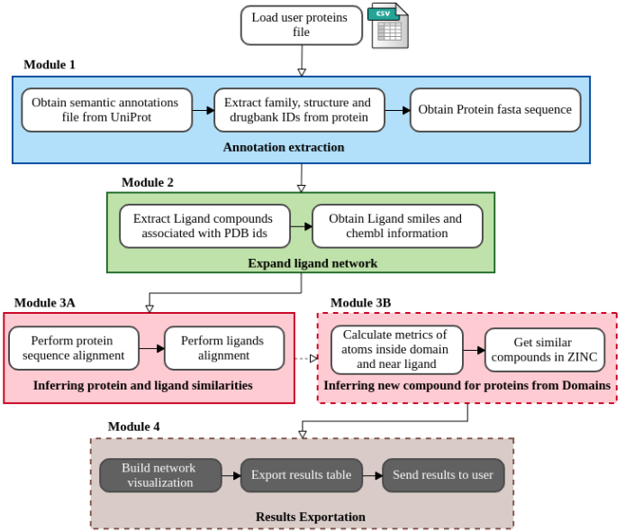

# Ligwebapp

Web application and pipeline to perform proteins enrichment and provide ligands recommendation from a structural perspective with a network visualization

## Summary
Ligwebapp searches domain annotations, PDB structures and its respective ligands directly associated to these proteins and drugs that have these proteins as targets. It provides a network visualization and a statistical summary of the proportion of these node types. As an additional procedure, it offers ligands inference from structures annotated in the same domains as the protein seeds.

Ligwebapp starts with the annotation workflow (module 1), in which it obtains the semantic file with the protein annotations from Uniprot, extract the relevant annotations for the application that are the domains pFAM, PDB structures and drugbank identifiers as well as the fasta aminoacid sequence. The module 2 expands the network retrieving the ligands of each structure previously found using PDB API and also maps the PDB ligand identifier to chembl and the respective molecular representation in smiles. The module 3A performs an attempt to generate more connections calculating the identity among the AA sequences of the proteins and also calculating the tanimoto score among the discovered ligands. Once the user enables the ligand inference, the module 3B is activated and get all protein structures annotated with the same domain as each input protein, extracts the AA sequence of these structures corresponding to the mapped domain region and aligns with the input protein sequence. The structures that obtained an identity above the threshold chosen by the user are analyzed in relation to their respective ligands, verifying if there are the chosen number of amino acids in the domain mapped region in a distance under 10A from the ligand atoms. Then, the ligands attending the last criteria are translated into the smiles representation to search for commercially available compounds in ZINC database. The last module (module 4) then wraps all the calculated results of each step and sends a compressed file to the user by e-mail.

The figure below illustrates the steps of this workflow.

<div style="text-align: center">
	
</div>

## Requirements:
	- Protein seeds (required): text file containing one uniprot protein identifier in each line
    - Tanimoto score (required): cutoff for ligands alignment
	- Number of ligand contacts (optional): integer number used as cutoff to filter ligands of stuctures in same domain to search in ZINC database
	- Percentage of conserved AAs in domain (optional): value ranging from 10 to 100, representing the proportion of aminoacids of the domain region in the alignment of structures sequences and protein seeds sequences
    - E-mail: put a valid e-mail address to receive the complete report concerning the input proteins
    
## Usage Instructions
The steps below consider the creation of a sqlite database file with all he tasks events which can be used after to retrieve the execution time taken by the tasks. It is possible run locally too (see luigi's documentation to change the running command). <br ><br>
* Preparation:
	1. ````git clone https://github.com/YasCoMa/ligwebapp.git````
	2. ````cd ligwebapp````
	3. ````conda env create -f ligwebapp.yml```` (if you do not have anaconda installed go to: https://www.anaconda.com/products/distribution )
	4. ````conda activate ligwebapp_env````
	5. ````Rscript run.R````
	
### Exporting conda environment dependencies
conda env export > ligwebapp.yml

### Authors and colaborators
Yasmmin Côrtes martins
Lucas Machado
Marisa Fabiana Nicolas
Dario Fernandez do Porto
Adrian Turjanski
Marcelo Marti

This application is an extension of the Lig-q web server, whose publication data is below:
RADUSKY, LEANDRO; RUIZ-CARMONA, SERGIO; MODENUTTI, CARLOS; BARRIL, XAVIER; TURJANSKI, ADRIAN G.; MARTÍ, MARCELO A.
LigQ: A Webserver to Select and Prepare Ligands for Virtual Screening
JOURNAL OF CHEMICAL INFORMATION AND MODELING; Año: 2017 vol. 57 p. 1741 - 1746


